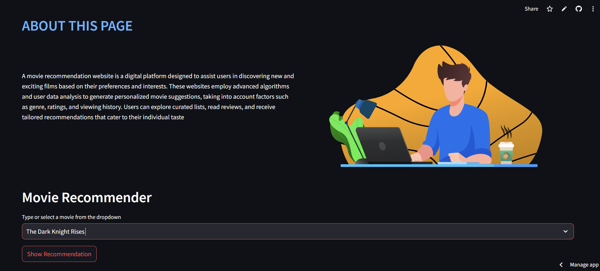
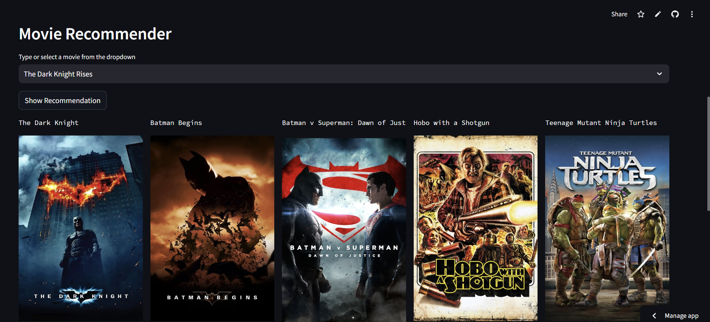

# Movie Recommendation System

🎬 **Welcome to the Movie Recommendation System!**  
This project is a content-based movie recommendation system built using Python, Pandas, and Scikit-learn. It recommends movies based on their similarity to a given movie, using features like genres, keywords, cast, and crew.

---

## **Features**
- **Content-Based Recommendations**: Recommends movies based on their similarity to a selected movie.
- **Interactive Interface**: Built with Streamlit for a user-friendly experience.
- **Scalable**: Can be extended to include more features or datasets.

---

## **How It Works**
1. The system uses **cosine similarity** to compare movies based on their metadata (genres, keywords, cast, and crew).
2. When a user selects a movie, the system recommends the top 5 most similar movies.

---

## **Demo**
Check out the live demo of the app: 
- [website links] 
- (https://movie-recommender-k.streamlit.app/)
- (https://movie-recommend-system-2w3p.onrender.com)


## **Screenshot 1**:





## **Screenshot 2**:




---

## **Installation**
To run this project locally, follow these steps:

1. **Clone the repository**:
 ```
   git clone https://github.com/your-username/your-repo-name.git
   cd your-repo-name
 ```
2.**Set up a virtual environment**:
```
python -m venv venv
source venv/bin/activate  # On Windows, use `venv\Scripts\activate`
```

3.**Install dependencies**:
```
pip install -r requirements.txt
```
4.**Run the Streamlit app**:

```
streamlit run app.py
```
5.Open your browser and go to http://localhost:8501 to view the app.

---
## **File Structure** :
``` 
Movie-Recommend-System/
├── app.py                       # Streamlit app script
├── movie_list.pkl               # Preprocessed movie data
├── similarity.pkl               # Precomputed similarity matrix
├── requirements.txt             # List of dependencies
├── notebook86c26b4f17.ipynb     # jupyter notebook file
├── style.css                    # Frontend file
├── README.md                    # readme file
└── data/                        # Folder containing raw data
    ├── tmdb_5000_movies.csv
    └── tmdb_5000_credits.csv
```

---

## **USAGE** :
1.Select a movie from the dropdown menu.
2.Click the Recommend button.
3.The app will display the top 5 movies similar to your selection.

---

## **Technologies Used** :
```
Python: Core programming language.
Pandas: Data manipulation and analysis.
Scikit-learn: Machine learning and cosine similarity.
Streamlit: Web app framework for deployment.
```
---

## **Dataset** :
  The dataset used in this project is the TMDB 5000 Movie Dataset, which contains metadata for over 5000 movies. You can find the dataset on Kaggle.
  
---

## **License** 
This project is licensed under the MIT License. See the LICENSE file for details.

---
## **Acknowledgments** :
 Dataset: TMDB 5000 Movie Dataset.
 
---
Streamlit: For making deployment easy and fun.
